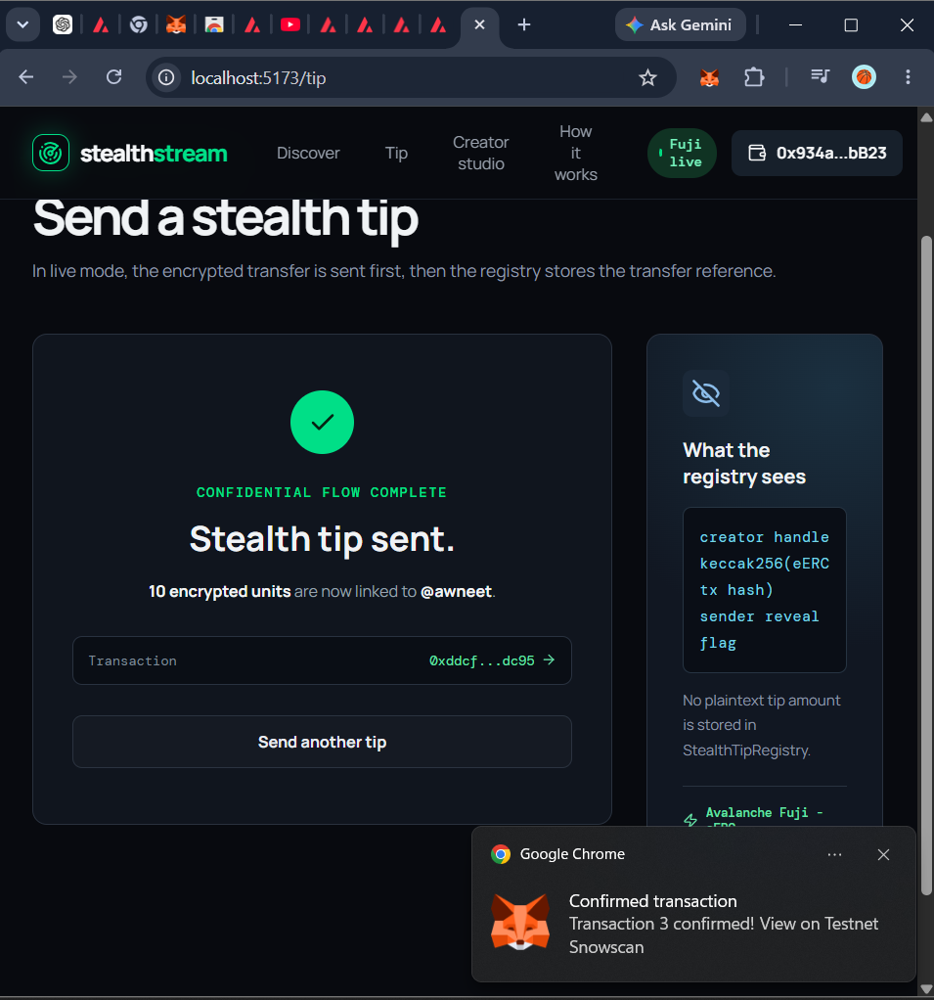
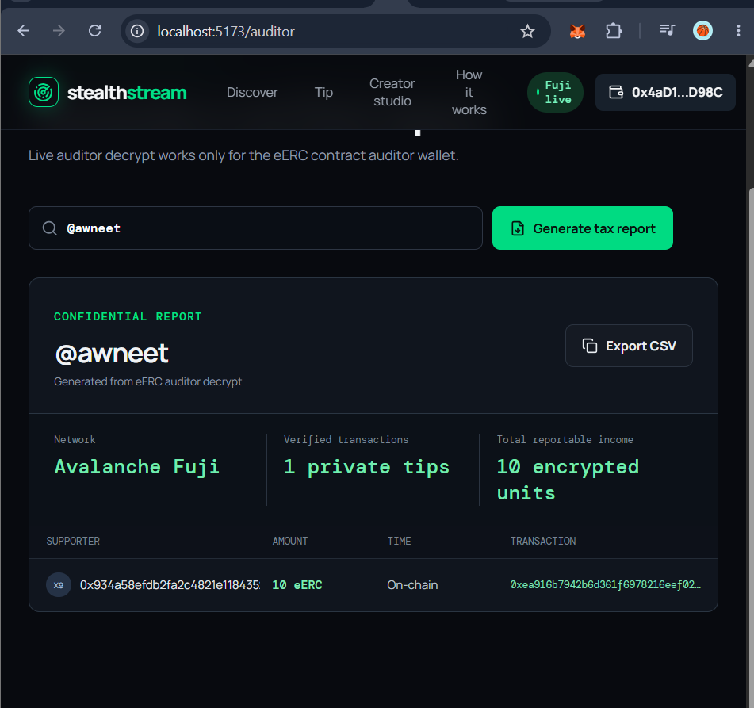
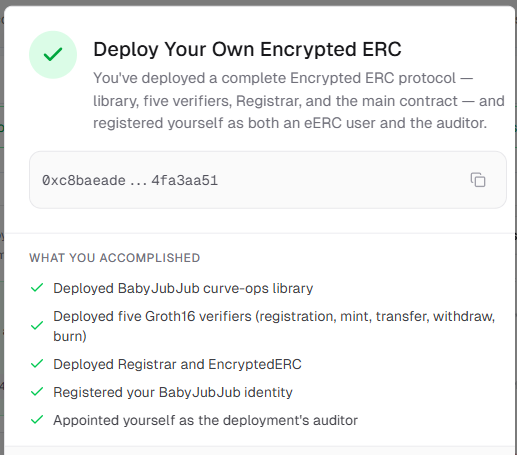
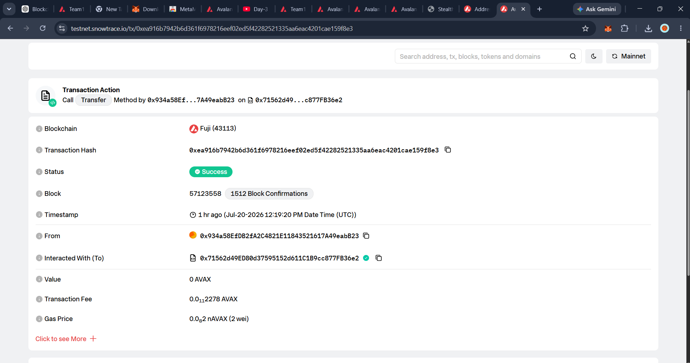

# StealthStream — Private Creator Tips on Avalanche

StealthStream lets supporters send encrypted creator tips using Ava Labs eERC on Avalanche Fuji. The payment amount remains encrypted on-chain; a small registry stores only a creator handle, an optional sender reveal flag, and a hash of the eERC transaction.

**This is a working Fuji prototype, not a frontend-only simulation.** Demo Mode remains available for a wallet-free walkthrough, while Live Mode uses MetaMask, a deployed eERC contract, and a deployed Solidity registry.

**[Open the live app](https://stealth-stream-seven.vercel.app)** · **[Watch the live demo video](https://www.youtube.com/watch?v=njZs5hv6tt8)**

## Hackathon demo flow

1. Open the [live app](https://stealth-stream-seven.vercel.app) with the eERC owner wallet connected to **Avalanche Fuji**.
2. The eERC owner unlocks its local encrypted wallet with a MetaMask signature, then privately mints test eERC to a registered sender.
3. Switch MetaMask to the pre-registered sender wallet. It unlocks its local encrypted wallet, enters `@awneet` on **Tip**, and the deployed registry resolves the creator wallet automatically.
4. Confirm the encrypted eERC transfer, then the separate `StealthTipRegistry.recordTip` transaction in MetaMask.
5. Switch MetaMask back to the configured eERC auditor wallet and use **Open verified report** in Creator Studio.
6. Generate the report and export CSV. It decrypts confirmed incoming encrypted transfers locally for the authorized auditor.

The [video walkthrough](https://www.youtube.com/watch?v=njZs5hv6tt8) shows this complete flow with real Avalanche Fuji transactions. **Demo Mode** remains available for a wallet-free local walkthrough.

## Live Fuji proof

| Item | Fuji deployment / transaction |
| --- | --- |
| StealthTipRegistry | [`0xE916...470cF`](https://testnet.snowtrace.io/address/0xE9164FB0E0F6b09d87fE10eca5c01E81d91470cF) |
| EncryptedERC, standalone mode | [`0x7156...b36e2`](https://testnet.snowtrace.io/address/0x71562d49ed80d37595152d611c1b9cc877fb36e2) |
| Creator registration, `@awneet` | [`0x21cb...84205`](https://testnet.snowtrace.io/tx/0x21cb71edac8dafcaff79885cc5227d58a9d2ba7f61788b464557e51b30084205) |
| Confirmed encrypted eERC transfer | [`0xea91...9f8e3`](https://testnet.snowtrace.io/tx/0xea916b7942b6d361f6978216eef02ed5f42282521335aa6eac4201cae159f8e3) |
| Confirmed registry reference | [`0xddcf...ddc95`](https://testnet.snowtrace.io/tx/0xddcfc8840361a7438bea0f7b7223b1f6e674f76311f8d1538e5b86cd1c2ddc95) |

The eERC contract uses 2 internal decimals. Therefore the on-chain encrypted base-unit value `1000` is correctly displayed as **10 eERC** in the auditor report.

## Demo evidence

**Live encrypted tip confirmed in StealthStream**

<p align="center">
  
  
</p>

**Official eERC deployment and public Fuji confirmation**

<p align="center">
  
  
</p>

## Architecture

```text
Supporter wallet
  └─ eERC privateTransfer (encrypted amount and balance) ──► Creator wallet
                                                             │
StealthTipRegistry ◄── keccak256(eERC transfer tx hash) ────┘
  ├─ creator handle
  ├─ creator wallet
  └─ optional sender reveal flag

Authorized eERC auditor ──► locally decrypts permitted eERC activity
```

### What is private and what is public

- **eERC protects:** token balances and transfer amounts with Groth16 proofs and encryption.
- **Registry stores:** creator handle, creator wallet, a transaction-hash reference, and optional sender reveal metadata.
- **Registry never stores:** a plaintext tip amount.

This is confidential value transfer, **not full sender/recipient anonymity**. The eERC transaction parties remain visible on the public chain; the protected data is the value.

## Stack

- React 18 + Vite
- wagmi 2 + viem 2 + ethers 6
- `@avalabs/eerc-sdk` 1.0.2
- Solidity 0.8.24 + Hardhat 3
- Avalanche Fuji C-Chain (chain ID `43113`)
- Official Builder Console-compatible eERC proving assets bundled in `public/circuits/official`

## Run from a clean clone

### 1. Prerequisites

- Node.js 22 or later
- MetaMask (only required for Live Mode)
- Fuji AVAX (only required for transaction gas)

### 2. Install and verify

```bash
npm install
npm run contracts:compile
npm run contracts:test
npm run build
```

Expected test result:

```text
# pass 2
# fail 0
```

### 3. Start the app

```bash
npm run dev -- --force
```

Open the local URL shown by Vite, normally `http://localhost:5173`.

## Demo Mode (no wallet required)

In `.env` set:

```env
VITE_APP_MODE=demo
```

Restart Vite. You can now click through the product without MetaMask or Fuji AVAX.

## Live Mode (real Fuji transactions)

Create `.env` by copying `.env.example`. Use these public runtime values for the deployed demo:

```env
VITE_APP_MODE=live
VITE_FUJI_RPC_URL=https://api.avax-test.network/ext/bc/C/rpc
VITE_FUJI_EXPLORER=https://testnet.snowtrace.io
VITE_TIP_REGISTRY_ADDRESS=0xE9164FB0E0F6b09d87fE10eca5c01E81d91470cF
VITE_EERC_CONTRACT_ADDRESS=0x71562d49ed80d37595152d611c1b9cc877fb36e2
```

Do **not** put a private key in any variable beginning with `VITE_`. Vite exposes those values to every website visitor.

The required matching `.wasm` and `.zkey` proving artifacts are already included under `public/circuits/official`. Do **not** add `VITE_EERC_*_WASM` or `*_ZKEY` values.

### Live demonstration path

The live encrypted flow uses pre-registered eERC test wallets because eERC identities are tied to a wallet signature and registrar entry.

1. Select **Avalanche Fuji C-Chain** in MetaMask.
2. Connect a sender wallet registered with this EncryptedERC deployment and unlock its local encrypted wallet from **Wallet & audit settings**.
3. Open **Tip**, enter `@awneet`, and confirm that the creator wallet is resolved from the deployed registry.
4. Enter a small valid eERC amount and approve the encrypted eERC transfer followed by the registry `recordTip` transaction.
5. Connect the configured auditor wallet, use **Open verified report**, then click **Generate tax report**.
6. Click **Export CSV** or open a transaction hash in Snowtrace for independent Fuji confirmation.

The UI waits for confirmed Fuji receipts before reporting success. If the eERC transfer succeeds but the registry write is interrupted, the app retains the reference locally and retries the registry write rather than sending a duplicate tip.

## Contract commands

| Command | Purpose |
| --- | --- |
| `npm run dev` | Start the Vite app |
| `npm run build` | Run TypeScript checks and create `dist/` |
| `npm run contracts:compile` | Compile Solidity and export the frontend ABI |
| `npm run contracts:test` | Run the registry test suite |
| `npm run deploy:fuji` | Deploy a new StealthTipRegistry to Fuji |
| `npm run register:creator` | Register a creator handle on the configured registry |
| `npm run verify:fuji -- <address> <constructorArgs>` | Attempt explorer verification |

## Deploy a new registry

This is only needed if you want your own replacement deployment.

1. Get Fuji AVAX.
2. Set these **non-public** `.env` values:

```env
FUJI_RPC_URL=https://api.avax-test.network/ext/bc/C/rpc
DEPLOYER_PRIVATE_KEY=0xYOUR_TEST_WALLET_PRIVATE_KEY
INITIAL_ADMIN_ADDRESS=0xYOUR_ADMIN_WALLET
INITIAL_APPROVED_WALLETS=0xCREATOR_WALLET,0xSENDER_WALLET
```

3. Run:

```bash
npm run deploy:fuji
```

4. Copy the output contract address into:

```env
VITE_TIP_REGISTRY_ADDRESS=0xYOUR_NEW_REGISTRY
TIP_REGISTRY_ADDRESS=0xYOUR_NEW_REGISTRY
CREATOR_HANDLE=@your_creator_handle
```

5. Run:

```bash
npm run register:creator
```

Never commit `.env` or use a wallet holding real mainnet funds as the deployer.

## Official references

- [Speedrun: Privacy on Avalanche](https://build.avax.network/events/b5e9fe35-5b5d-4fac-8709-e8eac8a1eaee)
- [eERC SDK overview](https://docs.avacloud.io/encrypted-erc/usage/sdk-overview)
- [Avalanche Fuji](https://build.avax.network/docs/primary-network/testnet-fuji)
- [Avalanche L1 transaction allowlist](https://build.avax.network/docs/avalanche-l1s/precompiles/transaction-allowlist)
